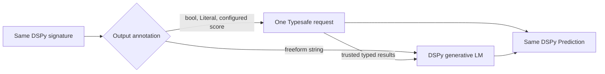

# `typesafeify`: a Typesafe decorator for DSPy

This is a deliberately stripped-down proof-of-concept fork of
[DSPy](https://github.com/stanfordnlp/dspy). It exists to test one idea in
isolation: can a normal DSPy signature opt into Typesafe's typed inference path
with one decorator, while application code keeps constructing and calling
`dspy.Predict` exactly as before?


The meaningful integration diff is intentionally tiny:

```diff
 from typing import Literal

 import dspy
+from typesafe_dspy import typesafeify

+@typesafeify(score_fields={"severity_score": [1, 5]})
 class SupportTicketTriage(dspy.Signature):
     ticket: dict = dspy.InputField()
     customer_impacting: bool = dspy.OutputField()
     owner_team: Literal["api-platform", "billing", "checkout", "infra", "support-ops"] = dspy.OutputField()
     severity_score: float = dspy.OutputField()
     internal_summary: str = dspy.OutputField()
```

The caller does not learn a new predictor API:

```python
predictor = dspy.Predict(SupportTicketTriage)
result = predictor(**ticket_context)
```

## What happens after adding the decorator

`@typesafeify(...)` reads the signature's output annotations and builds a
hybrid execution plan.



| Signature output | Plain DSPy | With `@typesafeify(...)` |
| --- | --- | --- |
| `customer_impacting`, `needs_human_now` | Generated by the DSPy LM | Typesafe `Noul` probabilities, thresholded into `bool` |
| `owner_team`, `severity_band` | Generated by the DSPy LM | Typesafe `Choice` decisions with per-option probabilities |
| `severity_score` | Generated by the DSPy LM | Typesafe `Score`, mapped back onto the declared 1–5 scale |
| `internal_summary` | Generated by the DSPy LM | Generated by the DSPy LM after the five typed results are known |

The demo keeps separate baseline and decorated signature files only to make a
controlled before/after run possible. Before sending either request, it proves
that both signatures have identical fields and instructions.

## Use an explicit predictor

Use `TypesafePredict(..., strict=True)` to evaluate every output with TypeSafe.
It needs no DSPy LM and does not itself modify `dspy.Predict` or register custom
field arguments. It accepts the same decorated signatures and field configuration
as the existing integration; decorators and global configuration are optional,
not incompatible.

The example requires `typesafe_dspy`, the TypeSafe Python SDK, and a
`TYPESAFE_API_KEY` environment variable.

```python
import dspy
from typesafe_sdk import TypeSafeClient
from typesafe_dspy import Score, TypesafeConfig, TypesafePredict, typesafe_results

class Review(dspy.Signature):
    """Evaluate the claim using only the supplied evidence."""

    claim: str = dspy.InputField(desc="The assertion to check.")
    evidence: str = dspy.InputField(desc="Source material for checking the claim.")
    supported: bool = dspy.OutputField(desc="Does the evidence establish the claim?")
    relevance: Score[
        "Evidence does not address the claim",
        "Evidence addresses part of the claim",
        "Evidence directly addresses the entire claim",
    ] = dspy.OutputField(
        desc="How much of the claim does the evidence address, whether supporting or contradicting it?"
    )

with TypeSafeClient() as client:
    predict = TypesafePredict(
        Review,
        typesafe_config=TypesafeConfig(client=client, model="jev-latest"),
        strict=True,
    )
    result = predict(
        claim="The museum opens at 9 a.m. on Sundays.",
        evidence="Sunday opening hours: 10 a.m. to 5 p.m.",
    )

print(result.supported)                          # bool
print(float(result.relevance))                   # numeric rubric position, 0–2
details = typesafe_results(result)
print(details["supported"].probability)          # probability of yes
print(details["relevance"].probabilities)         # probability per rubric level
print(details["relevance"].confidence)            # distribution concentration
```

### Compose with existing TypeSafe and DSPy programs

`Score[...]` describes an output field; it does not select an execution method.
The same signature works through the existing entry points:

| Existing entry point | How it composes |
| --- | --- |
| `@typesafeify(...)` / `@typesafe_signature(...)` | Attach field configuration to a signature. `TypesafePredict` reads that configuration, including legacy `score_fields`. The decorators themselves do not patch DSPy. |
| `configure_typesafe(...)` + `dspy.Predict` | Continue using decorated signatures through the global runtime. `Score[...]` fields use the same score planner. |
| `TypesafePredict(signature, typesafe_config=config)` | Use a decorated or undecorated signature explicitly. Pass a `TypesafeConfig` directly or reuse the object returned by `configure_typesafe(...)`. |
| `enable_typesafe(program, typesafe_config=config)` | Wrap existing predictors inside a DSPy module. Score annotations remain on their signatures. Already-wrapped predictors are left unchanged. |

`configure_typesafe()` installs global interception for ordinary `dspy.Predict`
calls. Constructing `TypesafeConfig` directly avoids that global change. Explicit
predictors use the configuration passed to them rather than implicitly reading
the global runtime.

Keep each Score rubric in one place: a `Score[...]` annotation cannot also have
a `score_levels` or `choice_options` override. Per-field instruction overrides
can still be supplied through decorators or configuration. Existing `float`
outputs with configured score levels remain supported.

### Supported outputs and result metadata

All supported outputs in a signature are sent in one request and evaluated
independently against the same state. One output cannot read another's answer.

| Signature annotation | TypeSafe question | Prediction field | `typesafe_results(result)[field]` |
| --- | --- | --- | --- |
| `bool` | Noul | `True` when probability ≥ `noul_true_threshold` (default `0.5`) | `probability` |
| `Literal["billing", "technical"]` | Choice | Selected literal value | `probabilities`, `confidence` |
| `Score["Low", "Medium", "High"]` | Score | Float-compatible rubric position | `probabilities`, `confidence`, `expectation` |
| `float` with explicit Score field configuration | Score | Numeric expectation on the configured scale | `probabilities`, `confidence`, `expectation` |

Strict mode rejects unsupported outputs, such as freeform `str`, an unconfigured
`float`, or nested models, instead of falling back to an LM. It also rejects LM
generation options and Pydantic output constraints. Without `strict=True`, the
existing hybrid behavior remains: residual outputs require a configured DSPy LM.

### Define a Score rubric

Use Score for ordered levels of one dimension; use Choice for unordered
alternatives. TypeSafe assigns the descriptions positions `0, 1, 2, …` and
returns their probability-weighted mean. Probabilities `0.1, 0.4, 0.5` over three
levels therefore give a score of `1.4`, not the winning level `2`.

This score is a position on your rubric, **not confidence or a probability of
correctness**. Different distributions can have the same mean. Keep the
probabilities when the distinction matters to your application.

`Score[...]` produces a float subtype: comparisons and arithmetic work normally,
arithmetic returns plain floats, and JSON serialization produces a number.
Descriptions must be distinct, nonempty strings. TypeSafe accepts 2–10 levels;
write each description so it makes sense independently of its neighbors.

For a custom numeric scale, supply `(anchor, description)` pairs:

```python
severity: Score[(1, "Low"), (3, "Medium"), (10, "Critical")] = dspy.OutputField()
```

Custom anchors are an **integration-side conversion**, not a TypeSafe API
parameter. Jev receives only the ordered descriptions; the integration weights
its returned probabilities by your anchors. The same `0.1, 0.4, 0.5` distribution
gives `6.3` on the `1, 3, 10` scale. Metadata probabilities are keyed by those
anchors. Each field can declare a different rubric.

Anchors must be finite, strictly increasing integers or floats. Do not mix pairs
and description-only entries in one rubric. Values are validated against the
rubric's endpoints, and its range and descriptions appear in the JSON schema.

### How the signature becomes a request

The default builders preserve field descriptions as model-visible context:

| DSPy data | TypeSafe request location |
| --- | --- |
| Input values | `state.inputs` |
| Input/output field descriptions | `state.signature.inputs[field].description` / `state.signature.outputs[field].description` |
| Signature instructions | `state.signature.instructions` and each `questions[field].instructions.task` |
| Output field description | `questions[field].instructions.output_field.description` |
| Score rubric descriptions | `questions[field].criteria`, in declared order |

`TypesafeFieldConfig(instructions=...)` replaces that question's generated
instructions. Its field description remains in the default shared state.
A custom `document_builder` replaces the shared-state construction entirely.

### Compatibility and current limitations

- `Score[...]` is experimental runtime syntax. Static type checkers may reject
  its rubric parameters; it is not a standard Python generic annotation.
- DSPy JSON signature state must be loaded into an existing matching signature;
  it does not reconstruct the custom Score type declaration.
- Existing `TypesafeFieldConfig(score_levels=...)` mappings remain supported.
  Numeric-anchor annotations use `float` to accept fractional scales as well as
  integers. TypeSafe's probability **indices** remain integers.
- Legacy `score_fields` sequence shorthand now preserves fractional anchors and
  uses the unrounded midpoint. `[0, 5]` produces `0, 2.5, 5`; specify `[0, 2, 5]`
  to preserve the previous rounded scale.
- Choice/Score confidence describes distribution concentration, not a guarantee
  of correctness. Validate thresholds and rubric behavior on your own data.

See TypeSafe's [Score reference](https://docs.typesafe.ai/primitives/score) for
native scoring semantics and rubric-writing guidance.

## Run the hybrid comparison

Install the published Typesafe SDK and this fork's development dependencies:

```bash
uv sync --extra typesafe
```

Set `OPENAI_API_KEY` and `TYPESAFE_API_KEY`, then run the same three tickets
through both paths. Luna uses medium reasoning by default.

```bash
OPENAI_MODEL=gpt-5.6-luna \
  uv run python examples/typesafe_dspy_ticket_triage/run_demo.py \
  --limit 3 \
  --show-document
```

The command prints the execution plan, exact signature-parity check, typed
results and probabilities, field-by-field output differences, freeform text,
timing, token usage, and total modeled cost for every case.

## Before/after benchmark

Across the three observed cases, the decorated path averaged **1.958 seconds**
versus **2.329 seconds** for plain DSPy: **15.9% faster**, or a projected
**37.1 seconds saved per 100 sequential calls**. Average modeled cost fell from
**$0.000377 to $0.000263 per ticket**, a **30.1% reduction**.

The cost calculation will use these explicit inputs:

| Input | Rate | Status |
| --- | ---: | --- |
| Typesafe input tokens | $0.042 / 1M tokens | Supplied estimate; replace with a public pricing source when available |
| GPT-5.6 Luna input tokens | $0.20 / 1M tokens | [Published OpenAI rate](https://developers.openai.com/api/docs/models/gpt-5.6-luna) |
| GPT-5.6 Luna output and reasoning tokens | $1.20 / 1M tokens | [Published OpenAI rate](https://developers.openai.com/api/docs/models/gpt-5.6-luna) |

The modeled totals use every priced category in the table: Luna input,
Luna output plus reasoning, and Typesafe input. Typesafe output-token usage is
reported by the demo but is not assigned a cost because the supplied Typesafe
rate covers input tokens only.

## Proof-of-concept layout

- [`typesafe_dspy/hybrid.py`](typesafe_dspy/hybrid.py): decorator, signature
  planning, hybrid execution, and result metadata
- [`examples/typesafe_dspy_ticket_triage/`](examples/typesafe_dspy_ticket_triage/):
  runnable controlled comparison
- [`tests/typesafe_dspy/test_hybrid.py`](tests/typesafe_dspy/test_hybrid.py):
  behavior and score-scale preservation tests

This fork is an experiment, not a replacement distribution for upstream DSPy.
For DSPy itself, use the [upstream project and documentation](https://dspy.ai/).
